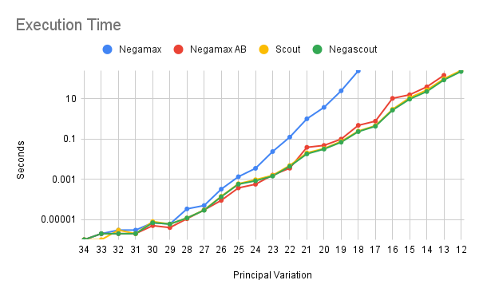
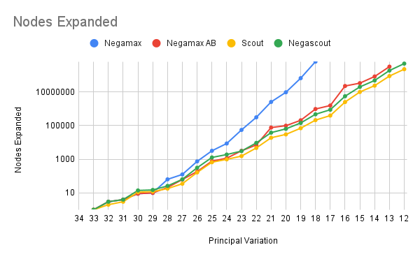
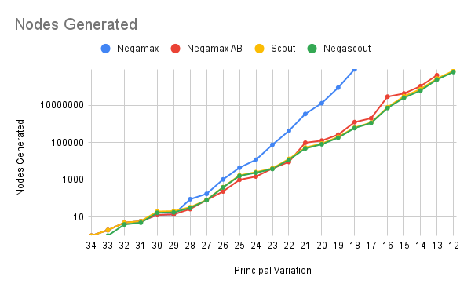

# Objetivo

El objetivo del proyecto es aprender sobre el modelo de árboles de juego
y algoritmos básicos de solución. Trabajaremos con una versión
reducida del juego de Othello.

# Material entregado

Se entrega una representación *incompleta* de la variante 6x6 de Othello (el juego
completo tiene un tablero 8x8), y un programa principal para evaluar los algoritmos
implementados. También se incluye un artículo en cuyo apéndice
se describe la versión 6x6 de Othello y una variación principal del
mismo. Es importante leer dicho artículo para entender cómo proceder en el resto del proyecto.

# Actividad 1

Completar y verificar la representación dada del juego

# Actividad 2

Implementar los siguientes algoritmos para árboles de juego:
* Negamax sin poda alpha-beta
* Negamax con poda alpha-beta
* Scout
* Negascout = negamax con poda alpha-beta + scout

# Actividad 3

Para asegurarnos que la implementación de los algoritmos es
correcta, evaluamos los mismos a lo largo de la *variación principal*.
El valor del juego es -4 y por lo tanto, todo nodo sobre la variación
principal debe evaluar a dicho valor.

Para cada algoritmo, la evaluación se hace comenzando sobre el 
tablero terminal en la variación principal, y subimos a lo
largo de la misma. Cada vez que subimos, volvemos a ejecutar el algoritmo
de solución a partir del nodo actual hasta que termine o hasta
que el límite de tiempo expire.

El mejor algoritmo es aquel que puede llegar más lejos (arriba)
sobre la variación principal del juego.

# Entregables

Se debe entregar, en el repositorio, todo el código implementado,
los resultados experimentales, y un pequeño informe que describa lo que
hicieron y sus conclusiones.

# Detalles de implementacion
Nos tomamos un tiempo para entender el codigo del profesor Blai, completamos la implementacion agregando el chequeo y procesamiento de las diagonales. Tambien implementamos una funcion nueva:
```c++
std::vector<int> get_valid_moves(bool color)
```
Esta recibe un color (blanco o negro), y retorna un vector de todos los movimientos posibles para ese jugador. La implementacion de esta funcion se basa en la de get_random_move(), con la diferencia de que en lugar de retornar un movimiento al azar retorna toda la lista.

Modificamos el main agregando la implementacion de los algoritmos: negamax, negamax AB, scout, negascout.

A la hora de implementar cada uno de los algoritmos nos basamos en el pseudo-codigo de las clases, corrigiendo algunos errores que encontramos. Adicionalmente se crearon las funciones auxiliares _mayorQue_ y _mayorIgual_ para pasarlas como codicional en las llamadas recursivas de scout.

# Tabla de resultados

| | | Negamax| | | NegamaxAB | | | Scout | | | Negascout | |
|:---:| :---:| :---:| :---:| :---:| :---:| :---:| :---:|:---:| :---:| :---:| :---:| :---:|
| PV | Expanded | Generated | Seconds | Expanded | Generated | Seconds | Expanded | Generated | Seconds |  Expanded | Generated | Seconds |
| 34 | 0 | 1 | 1.00001e-06 | 0 | 1 | 1.00001e-06 | 0 | 1 | 1.00001e-06 | 0 | 0 | 1.00001e-06 |
| 33 | 1 | 2 | 2.00002e-06 | 1 | 2 | 2.00002e-06 | 1 | 2 | 9.99949e-07 | 1 | 1 | 2.00002e-06 |
| 32 | 3 | 5 | 2.99996e-06 | 3 | 5 | 1.99996e-06 | 2 | 5 | 2.99996e-06 | 3 | 4 | 2.00002e-06 |
| 31 | 4 | 6 | 2.99996e-06 | 4 | 6 | 2.00002e-06 | 3 | 6 | 2.00002e-06 | 4 | 5 | 1.99996e-06 |
| 30 | 9 | 13 | 7e-06 | 9 | 13 | 5.00004e-06 | 11 | 20 | 8e-06 | 14 | 17 | 7e-06 |
| 29 | 10 | 14 | 5.99999e-06 | 10 | 14 | 3.99997e-06 | 12 | 21 | 5.99999e-06 | 15 | 18 | 5.99999e-06 |
| 28 | 64 | 91 | 3.4e-05 | 21 | 27 | 1.1e-05 | 18 | 34 | 1.2e-05 | 26 | 31 | 1.2e-05 |
| 27 | 125 | 177 | 5e-05 | 62 | 82 | 3e-05 | 35 | 84 | 3e-05 | 64 | 81 | 2.9e-05 |
| 26 | 744 | 1049 | 0.000325 | 186 | 238 | 9e-05 | 164 | 401 | 0.000143 | 312 | 389 | 0.000136 |
| 25 | 3168 | 4498 | 0.001349 | 769 | 1003 | 0.000375 | 663 | 1748 | 0.000606 | 1275 | 1631 | 0.000574 |
| 24 | 8597 | 11978 | 0.003521 | 1152 | 1502 | 0.00057 | 982 | 2622 | 0.000957 | 1894 | 2421 | 0.000844 |
| 23 | 55127 | 76826 | 0.02401 | 3168 | 4068 | 0.001623 | 1540 | 4141 | 0.001569 | 3051 | 3843 | 0.001447 |
| 22 | 308479 | 428402 | 0.125333 | 7031 | 9130 | 0.003575 | 4674 | 13285 | 0.004891 | 9329 | 11979 | 0.00441 |
| 21 | 2525249 | 3478735 | 1.01856 | 76021 | 98755 | 0.03905 | 18848 | 54461 | 0.020754 | 37988 | 48477 | 0.018353 |
| 20 | 9459570 | 13078933 | 3.77154 | 98129 | 127644 | 0.04851 | 29822 | 89091 | 0.033907 | 63570 | 81631 | 0.031828 |
| 19 | 65121519 | 90647895 | 25.1335 | 205017 | 267604 | 0.0997 | 69511 | 204351 | 0.077005 | 142595 | 184144 | 0.069974 |
| 18 | 625084814 | 876269598 | 246.199 | 960343 | 1259430 | 0.482669 | 209486 | 649026 | 0.25106 | 466161 | 605947 | 0.234376 |
| 17 |           |           |         | 1549785 | 2031924 | 0.777346 | 391669 | 1189883 | 0.463945 | 870050 | 1134288 | 0.433431 |
| 16 |           |           |         | 22325108 | 29501798 | 10.5853 | 2494074 | 7989969 | 3.01469 | 5518091 | 7221811 | 2.74408 |
| 15 |           |           |         | 32949019 | 43574643 | 15.9557 | 9853100 | 30953399 | 11.4271 | 19705373 | 25831374 | 9.67324 |
| 14 |           |           |         | 82016158 | 107642871 | 39.5632 | 23453007 | 74581266 | 27.4338 | 47600678 | 62051335 | 23.0862 |
| 13 |           |           |         | 315074162 | 415909956 | 148.113 | 86804999 | 276935284 | 99.2533 | 185297022 | 242584981 | 87.026 |
| 12 |           |           |         |           |           |         | 222087243 | 713350259 | 258.213 | 477003110 | 623011942 | 228.497 |

# Gráficas
_Nota el eje Y esta en escala logarítmica_

## Execution Time  


## Nodes Expanded  


## Nodes Generated  


# Conclusiones

Tras analizar los resultados obtenidos al correr los algoritmos se puede apreciar que:
- Negamax presenta claramente el peor rendimiento, no pudiendo calcular el valor de juego de 17 movimientos en el futuro en menos de 15 minutos.
- El rendimiento de Negamax mejora considerablemente con la poda Alpha-Beta, pudiendo llegar a calcular el valor de juego de 21 movimientos en el futuro en menos de 15 minutos.
- Tanto Scout como Negascout logran calcular el valor de juego de 22 movimientos en el futuro con menos de 15 minutos. Sin embargo, Negascout expande el doble de estados pero genera menos.
- Se observa que el coste en tiempo del calculo de valor de juego para un movimiento crece vertiginosamente.